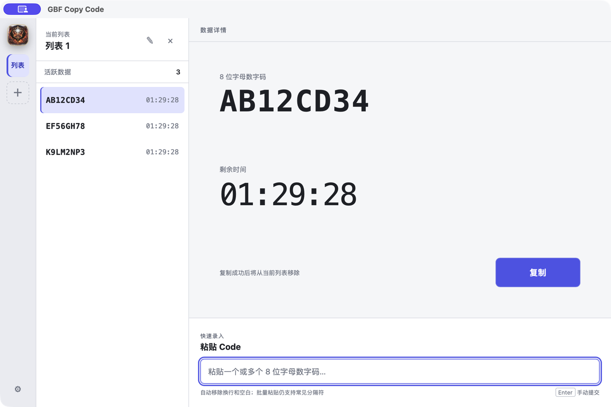

<div align="center">
  
  <h1>GBF Copy Code</h1>
  <p>面向《碧蓝幻想》星之古战场场景的本地 Code 队列工具。</p>

  [](https://github.com/Sorabb/gbf-copy-code/actions/workflows/ci.yml)
  [](https://github.com/Sorabb/gbf-copy-code/releases/latest)
</div>

## 为什么做这个工具

古战场期间，团友需要进行“拉闸换肉”操作时，Code 往往来自不同队伍或批次。直接在聊天窗口里维护容易重复、遗漏，也不方便判断 Code 是否已经失效。

GBF Copy Code 将这些 Code 保存为多个独立的本地队列：粘贴后立即开始 90 分钟倒计时，使用时点击“复制”，应用会先写入剪贴板，再从当前列表中移除，方便连续处理下一条。

> 这是一个纯本地辅助工具，不读取游戏数据，不注入游戏页面，也不包含任何自动化游戏操作。

## 界面预览



## 功能

- 创建多个独立列表，支持切换、重命名和删除。
- 支持单个或批量粘贴 8 位字母数字 Code。
- 自动移除输入中的换行、空格和 Tab 等空白字符。
- 同一列表内自动去重，不会重置重复 Code 的倒计时。
- 每条 Code 默认保留 90 分钟，并显示实时倒计时。
- 点击“复制”后先写入剪贴板，成功后自动删除并切换到下一条。
- 数据使用 SQLite 保存在当前设备，重启应用后继续原有倒计时。
- 后台自动清理已过期数据，无需手动维护。

## 下载与安装

前往 [Releases](https://github.com/Sorabb/gbf-copy-code/releases/latest) 下载对应平台的安装包：

- macOS：下载 `.dmg`。
- Windows：下载 NSIS `.exe` 安装程序。

当前发布包未进行 Apple 或 Microsoft 商业代码签名。系统首次运行时可能显示安全提示，请仅从本仓库的 Releases 页面下载安装包。

## 使用方法

1. 首次启动时选择“本地运行”。
2. 使用左侧 `＋` 创建列表，例如按队伍或批次命名。
3. 将一个或多个 Code 粘贴到下方输入框，应用会自动校验并入库。
4. 选择需要使用的 Code，点击右侧“复制”。
5. 复制成功后该 Code 自动移除，详情区域切换到下一条。

Code 必须严格符合 `^[A-Za-z0-9]{8}$`，并保持原始大小写。

## 本地开发

### 环境要求

- Node.js 22+
- Rust stable
- Tauri 2 对应的[系统依赖](https://v2.tauri.app/start/prerequisites/)

### 启动

```bash
npm install
npm run tauri dev
```

### 检查

```bash
npm run check
npm run build
cargo test --manifest-path src-tauri/Cargo.toml
cargo clippy --manifest-path src-tauri/Cargo.toml --all-targets -- -D warnings
```

### 本地打包

```bash
npm run tauri -- build
```

## 技术结构

```text
Svelte + TypeScript UI
          │
     Tauri Commands
          │
      Rust Service
          │
 SQLite Repository
```

- `src/`：页面、组件、状态与 Tauri 调用封装。
- `src-tauri/src/commands/`：前后端命令边界。
- `src-tauri/src/services/`：列表、Code、设置与过期业务逻辑。
- `src-tauri/src/db/`：SQLite schema 和 Repository。
- `src-tauri/src/scheduler/`：定时清理过期数据。
- `src-tauri/src/networking/`：后续联网模式的结构预留，当前未实现网络功能。

## CI/CD

- `CI`：提交和 Pull Request 会在 macOS、Windows 上执行前端检查、Rust 测试、格式检查和 Clippy。
- `Release`：推送 `v*` 标签后自动构建 macOS DMG 与 Windows NSIS 安装包，并创建 GitHub Draft Release。
- 也可以从 Actions 页面手动运行 Release 工作流，并输入要发布的 `v*` 版本号。

发布示例：

```bash
git tag v0.1.0
git push origin v0.1.0
```

## 数据与隐私

- 所有列表和 Code 仅存储在本机 SQLite 数据库中。
- 应用不需要账号，不上传数据，也不会连接 GBF 或任何游戏服务器。
- 数据库实际路径可在应用的“设置”页面查看。

## 免责声明

本项目是非官方玩家工具，与 Cygames, Inc. 无隶属、授权或背书关系。《Granblue Fantasy / 碧蓝幻想》及相关名称、图像和商标归其各自权利人所有。
